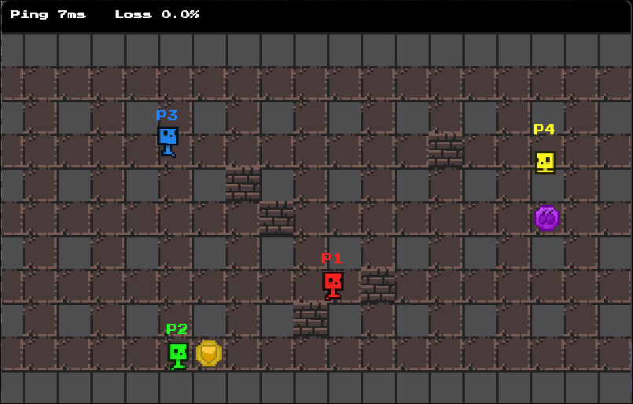
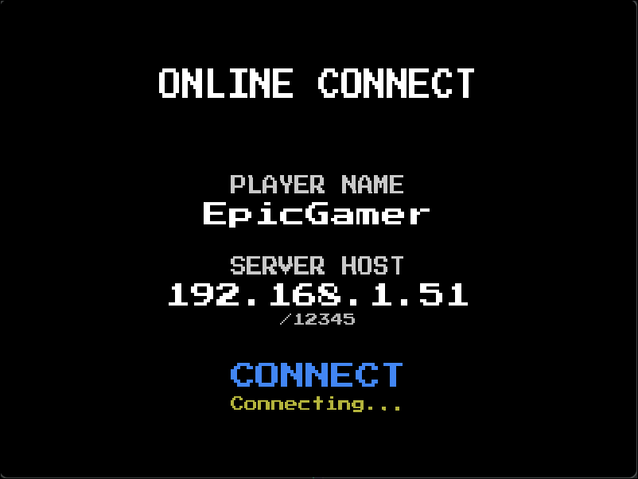
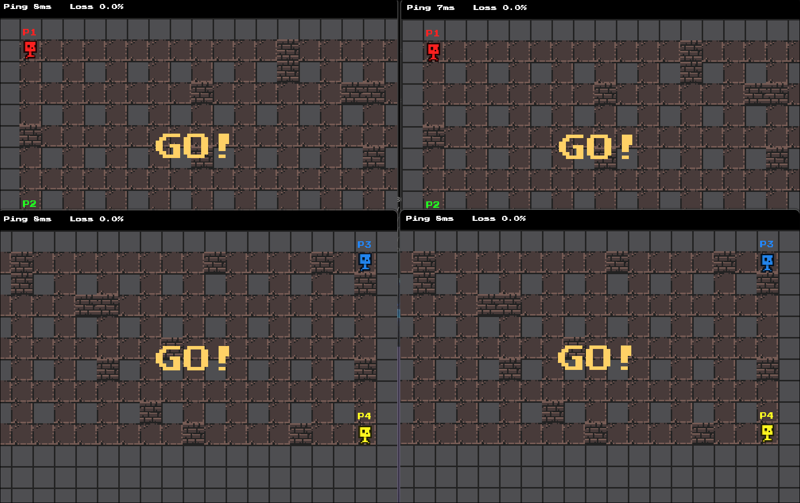
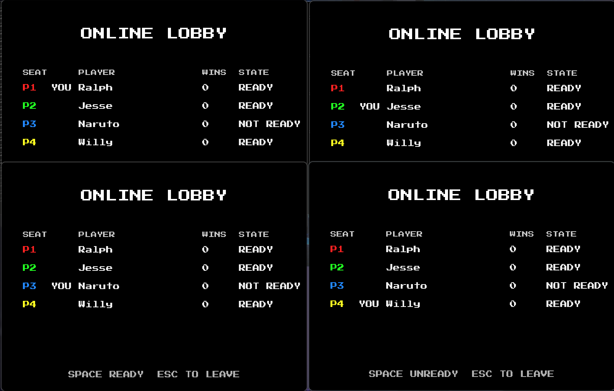

# Bomberman Multiplayer

Authoritative multiplayer networking layer for a Bomberman student project, with dedicated server flow,
explicit packet protocol, client prediction and correction, and built-in diagnostics.

Live documentation site: [v4lkdev.github.io/BombermanMultiplayer](https://v4lkdev.github.io/BombermanMultiplayer/)

| Gameplay | Connect Scene |
|:--|:--|
|  |  |

### Goals

This project extends a provided singleplayer Bomberman base in SDL2 with a client-server multiplayer architecture built on ENet.

The work focuses on four goals:
- add a clear **authoritative networking model** to an existing local game
- synchronise **gameplay-relevant state** across multiple clients
- keep runtime behaviour **observable** through logs, diagnostics, and test tooling
- document the system through clear architecture and design decisions

### My Contribution

My contribution is the multiplayer and networking layer added around the provided singleplayer base.

This includes:
- designing and maintaining the shared protocol in `Net/NetCommon.h`
- implementing the dedicated server runtime and authoritative round flow
- building the client netcode for connection handling, prediction, correction, and recovery
- integrating authoritative state into the multiplayer gameplay scene
- adding diagnostics, testing hooks, and technical documentation

### Key Technical Highlights

- **Authoritative client-server architecture** built on ENet
- **Fixed-size packet protocol** with explicit message ids, payload sizes, and channel assignments
- **Lobby bootstrap flow** from connect and ready state into synchronised match start
- **Prediction and correction pipeline** with replay-based recovery for the owning player
- **Built-in diagnostics and telemetry** for transport, correction, and runtime behaviour

### Third-Party Libraries

- `ENet`: lightweight UDP-based networking with channels and optional reliability
- `SDL2`: core client runtime for rendering, input, windowing, and timing
- `SDL2_image`: image loading for the client
- `SDL2_ttf`: font and text rendering for the client
- `SDL2_mixer`: audio playback for the client
- `spdlog`: structured logging and runtime diagnostics
- `nlohmann/json`: JSON output for diagnostics and tooling

### System Snapshot

The client sends gameplay intent, predicts local movement for responsiveness, and consumes authoritative updates from the server.  

The server owns shared match state, processes accepted input on fixed ticks, and replicates snapshots, corrections, and reliable gameplay events back to connected clients.

### Guided Reading

- [Architecture](docs/architecture.md)
- [Networking](docs/networking.md)
- [Testing](docs/testing.md)
- [Diagnostics](docs/diagnostics.md)
- [Reference](docs/reference.md)
- [Decisions And Development](docs/decisions-and-development.md)

---
### Build And Run

The repository includes CMake presets for Linux debug and release builds, plus Windows MinGW cross-build presets. All other dependencies are vendored in `third_party/`.

```bash
# Linux debug configure
cmake --preset linux-debug

# Linux client
cmake --build --preset linux-client-debug

# Linux server
cmake --build --preset linux-server-debug
```

```bash
# Run from the configured build directory
./build/linux-debug/Bomberman_Server
./build/linux-debug/Bomberman
```

For Windows cross-builds, use the `windows-debug` or `windows-release` configure presets together with the matching client build preset:

```bash
cmake --preset windows-release
cmake --build --preset windows-client-release
```

### Current Limitations

- no mid-match reconnect support
- no runtime seat reordering once players are in the lobby
- no server browser or larger matchmaking flow

### Media





<!-- Placeholder: short demo video link -->
<!-- Placeholder: architecture overview visual -->
<!-- Placeholder: prediction / correction callout -->


<div class="section_buttons">

|   |                                 Next |
|:--|-------------------------------------:|
|   | [Architecture](docs/architecture.md) |

</div>
